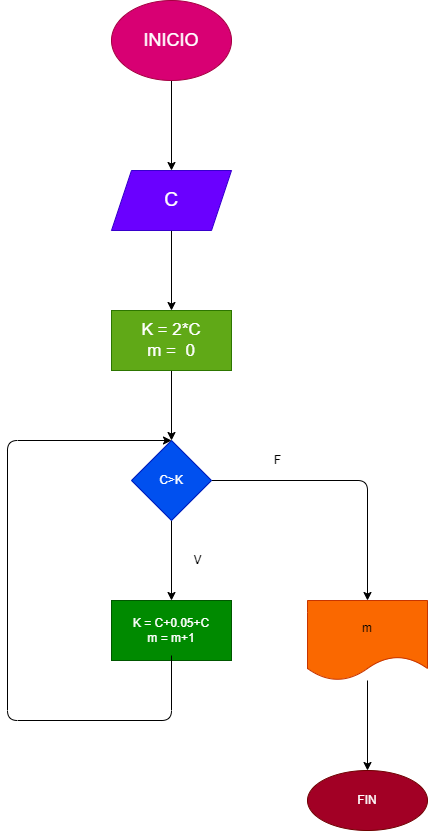

## Ejercicio 26: Hacer el diagrama y programa en python, que lea un capital C, que averigue e imprima en cuantos meses se duplica si lo colocamos a un interes compuesto del 5% mensual.

# Diagrama de Flujo

